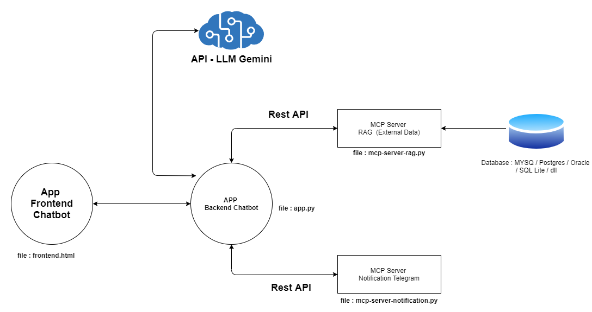
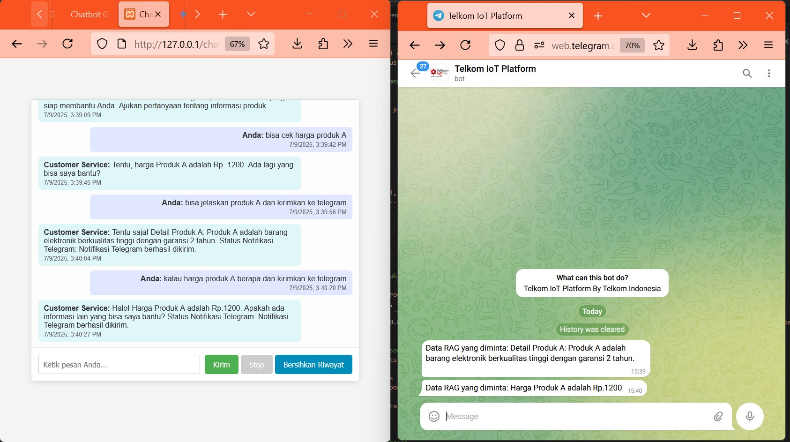
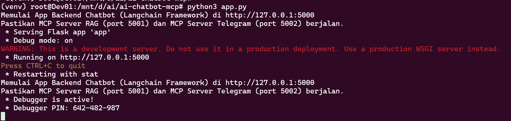
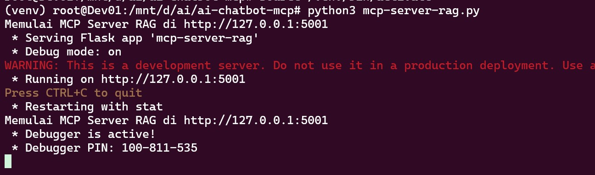
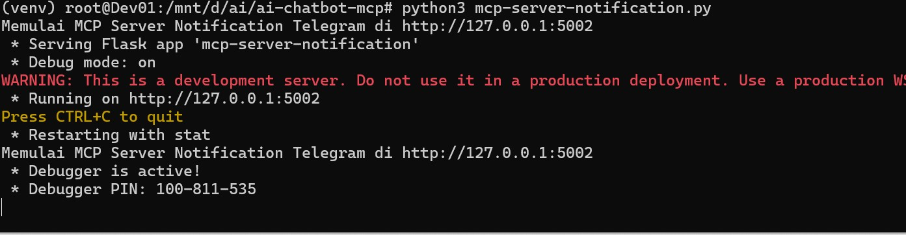

# Chatbot Customer Service - Combine AI LLM Gemini & SQL Database & Notification to Telegram with Concept MCP case

## About This Research

This research presents a **smart chatbot solution** designed to automate customer interactions, specifically for **customer service in retail stores**. The chatbot leverages the power of **Google Gemini LLM** for natural language processing (NLP), combined with **SQL database integration** for contextual product information management, and **Telegram notification capabilities** for real-time alerts to staff or relevant users.

Developed with the **Model Context Protocol (MCP)** concept, this chatbot is designed to be highly adaptable and easily integrated into various business and operational needs, ensuring both scalability and ease of maintenance.

### Key Features

* **Gemini LLM Integration:** Utilizes the advanced Gemini large language model to understand complex customer queries (e.g., about stock, prices, or product details) and generate relevant, easy-to-understand responses.
* **Dynamic SQL Database Queries:** Capable of connecting and interacting with SQL databases (e.g., PostgreSQL, MySQL, SQLite) to retrieve or update product data in real-time. This allows the chatbot to:
    * **Answer Stock Inquiries:** Provide accurate information on product availability.
    * **Present Product Prices:** Display the latest prices for inquired items.
    * **Provide Product Explanations:** Detail specifications, features, or descriptions of products.
* **Flexible Telegram Notifications:** Sends important notifications or updates directly to specific Telegram groups or users. This is particularly useful for:
    * **Forwarding Specific Queries:** Rerouting customer questions that the chatbot cannot answer to the customer service team via Telegram.
    * **Internal Notifications:** Sending automated alerts, such as low stock warnings or urgent inquiries.
* **Model Context Protocol (MCP) Concept:** A design that enables easy addition of new features, changes in business logic, or component replacement without disrupting the entire system. For instance, you can easily add integrations to other inventory systems or additional notification channels.
* **Customizable Configuration (MCP):** Flexible settings allow for easy adjustment of the chatbot's behavior, including Gemini prompts, database schemas, notification details, and default responses.
* **Optimal Performance (MCP):** Optimized for fast and efficient responses, ensuring a smooth user experience with minimal delay, even when interacting with the database.

**When an MCP Server hosts AI Agents, it can be referred to as an Agentic AI system.**

## Case Study: Retail Store Customer Service

This chatbot functions as an **AI Customer Service Agent** for a store, enabling visitors to:

* **Inquire about stock, prices, and detailed product explanations.** The AI agent intelligently retrieves and presents information from the database.
* **Forward complex questions** that the AI agent cannot answer to the customer service team via Telegram, ensuring no query goes unanswered.

Examples of interactions: "Is shoe XYZ size 42 in stock?", "What's the price of this batik shirt?", or "Tell me more about the gaming laptop series A."





The example below utilizes the Gemini LLM API.




Video Demo  


## Table of Contents

  * [1. Create Gemini API Key]
  * [2. Python & Dependencies Installation]
  * [3. Creating the Chatbot Backend Program]
  * [4. Creating the MCP Server RAG]
  * [5. Creating the MCP Server Notification Telegram]
  * [6. Creating the Chatbot Frontend Program]


## 1\. Create Gemini API Key

The first step is to create an API Key on aistudio.google.com to access the Gemini AI LLM using its API.


## 2\. Python & Dependencies Installation

To set up the Python environment and install the necessary libraries, follow these steps:

```bash
apt install python3.10-venv
python3 -m venv venv source venv/bin/activate pip install python-dotenv Flask requests langchain-google-genai langchain pyTelegramBotAPI
```

## 3\. Creating the Chatbot Backend Program (app.py)

Below is the Python script for the backend, which processes user queries by integrating the Gemini LLM API connection to MCP Server RAG dan MCP Server Telegram


**How to Run:**

```bash
python3 app.py
```




## 4\. Creating the MCP Server RAG  (mcp-server-rag.py)

Below is the Python script for the backend, which processes user queries by integrating the Gemini LLM API connection to MCP Server RAG dan MCP Server Telegram


**How to Run:**

```bash
python3 mcp-server-rag.py
```




## 5\. Creating the MCP Server Notification Telegram (mcp-server-notification.py)

Below is the Python script for the backend, which processes get or query data to database 


**How to Run:**

```bash
python3 mcp-server-notification.py
```




## 6\. Creating the Chatbot Frontend Program

Below is the script for the web-based frontend program that processes questions and displays AI-generated answers. This frontend can be run on a web server like Apache or Nginx, or simply by opening the HTML file directly in your browser while the backend is running.


## Contact

If you have questions, you can contact this email
Email: dendie.sanjaya@gmail.com
